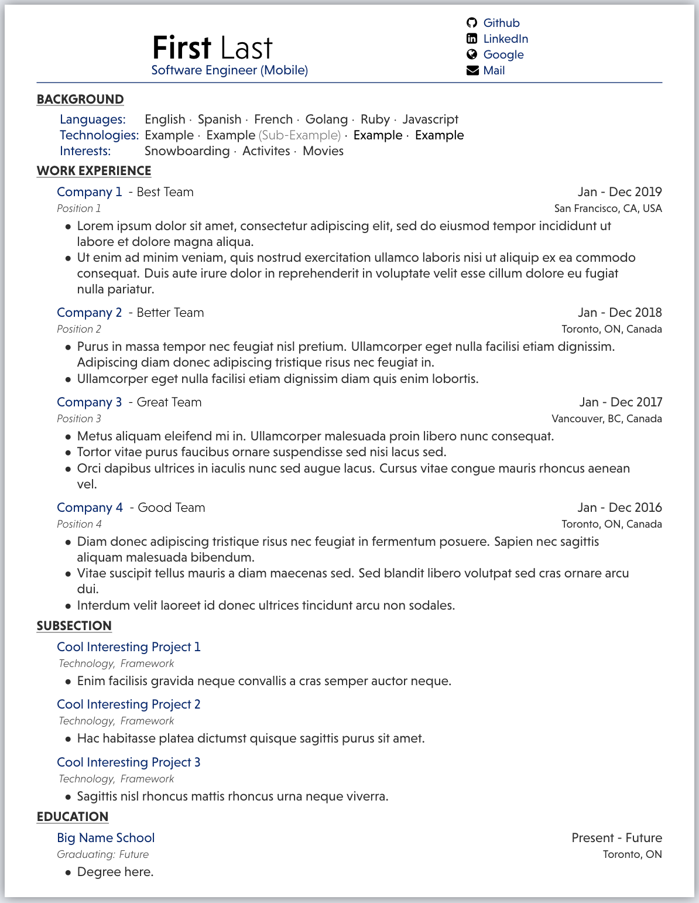

# Latex-Resume-Template
Latex resume templated targeted towards software engineer students

## Get Started
Any Latex editor will work but [Overleaf](https://www.overleaf.com/) is recommended.

### Steps To Edit
- Upload files to Latex editor and compile.
- Edit the "main.tex" file to edit the content.
- Edit the "custom.cls" file to edit the styling.

## EXAMPLE

